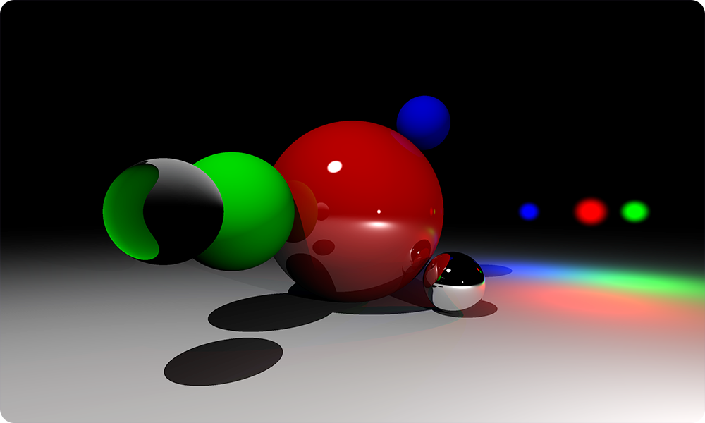

# Zrak

Jednostavan *raytracer* napisan u *Python* jeziku.

Program može da renderuje scenu koja se sastoji od niza lopti i niza izvora svetlosti. Lopte mogu da imaju različite optičke osobine; između ostalog mogu biti reflektujuće ili transparentne (u proizvoljnom odnosu). Izvori svetlosti su takođe sfernog oblika.

Program je napisan u edukativne svrhe i stoga je koncipiran kao najjednostavniji mogući. Shodno tome, postoji mnogo prostora za poboljšanje. Ipak, ovaj repozitorijum neće prihvatati nikakve *pull request*-ove osim ako ne ispravljaju neku veliku grešku na jednostavan način. *Bug*-ova svakako ima u ovom programu, ali su oni uglavnom posledica lošeg dizajna. 

## Pokretanje

Za pokretanje potrebno je da imate instalirano *Python* okruženje kao i pakete `numpy` i `matplotlib` (ovi paketi se mogu instalirati pomoću `pip install` komande).

Unutar repozitorijuma pokrenite komandu `python3 zrak.py`. Kroz par minuta bi trebalo da dobijete fajl `slika.png`.

## Licenca

Slobodni ste da klonirate, modifikujete i redistribuirate ovaj repozitorijum dokle god poštujete odredbe [BSD-3 licence](LICENSE).
